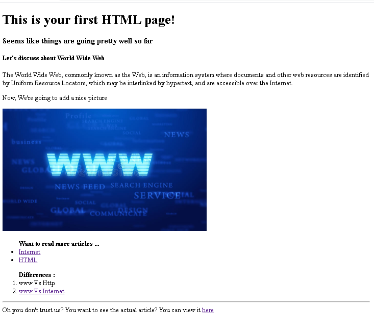

# HTML - Hyper Text Markup Language

> “Hypertext Markup Language is the standard markup language for documents designed to be displayed in a web browser. It can be assisted by technologies such as Cascading Style Sheets and scripting languages such as JavaScript.” — Wikipedia


**HTML Example**

```
<!DOCTYPE html>
<html>
  <head>
  
    <!--  The head contains Meta-data -->
    <meta charset="utf-8">
    <title> This is the Title! </title>
    
  </head>
  <body>
  
    <!-- The body contains the actual content -->

  </body>
</html>
```

<br>

## HTML Basics Exercise

Write the necessary HTML to make your page look just like this one:



## Additional Resources

* **Documentation**
  * [HTML Tutorial by w3schools.com](https://www.w3schools.com/html/)
  * [HTML docs by Mozilla](https://developer.mozilla.org/en-US/docs/Web/HTML)

* **Video Tutorials**
  * [HTML Full Course](https://youtu.be/pQN-pnXPaVg)
  * [HTML Crash Course For Absolute Beginners](https://youtu.be/UB1O30fR-EE)
