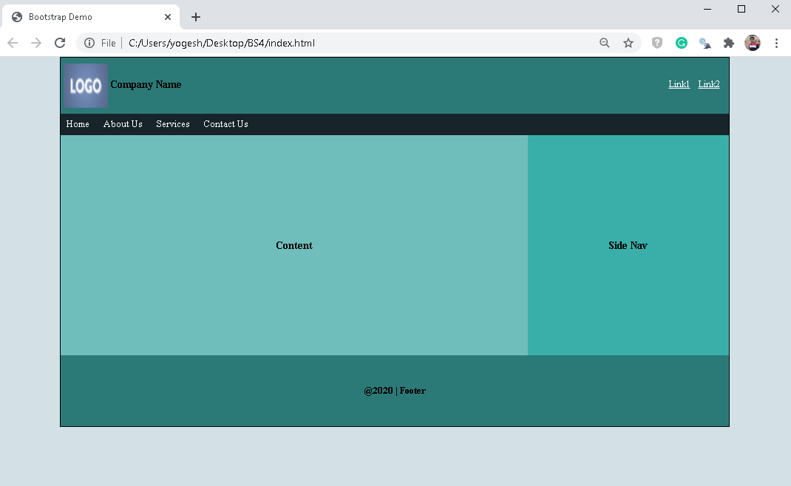

# CSS Basics Exercise

### Why is this important?

After this session, developers should be able to hand code a simple website from scratch with HTML and CSS. Nobody really starts from scratch with HTML and CSS anymore. But unless you master the basics, you can very easily fall into the trap of mastering ONE approach to CSS and feeling totally lost when you have to work with another. Our goal with these introductory lessons is to solidify your conceptual model of how these things go together and improve your knowledge of the core CSS properties so you can debug CSS more quickly, no matter what framework you encounter.

To practice working with selectors,make your page look just like this one:

Next, a great way to learn CSS is to try to rebuild a few common websites. Although these exercises may seem tedious, there is NO better way than to rebuild existing sites. You might be tempted to just look at the source code, and that is fine for inspiration, but really try to do this yourself!

Sites to rebuild:

[Google](https://www.google.com/)

[Hacker News](https://news.ycombinator.com/)

[Challenge: Box Office Mojo](http://www.boxofficemojo.com/)

### Additional Resources

* *Documentation*
  * [CSS Tutorial by w3schools.com](https://www.w3schools.com/css/)
  * [CSS docs by Mozilla](https://developer.mozilla.org/en-US/docs/Web/CSS)

* *Video Tutorials*
  * [CSS Tutorial - Zero to Hero](https://youtu.be/1Rs2ND1ryYc)
  * [CSS Crash Course For Absolute Beginners](https://youtu.be/yfoY53QXEnI)

* *Other Useful Links*
  * [http://learnlayout.com/](http://learnlayout.com/)
  * [http://code.tutsplus.com/tutorials/the-30-css-selectors-you-must-memorize--net-16048](http://code.tutsplus.com/tutorials/the-30-css-selectors-you-must-memorize--net-16048)
